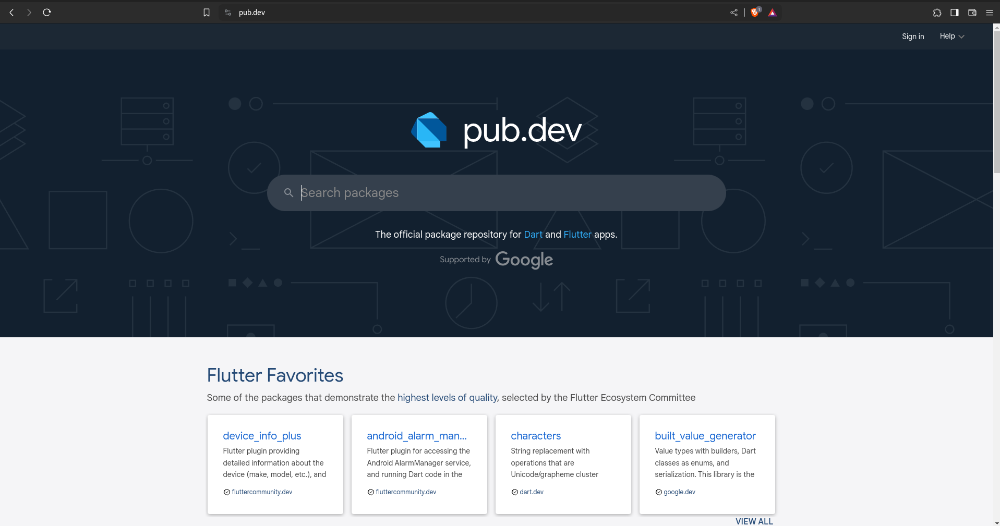
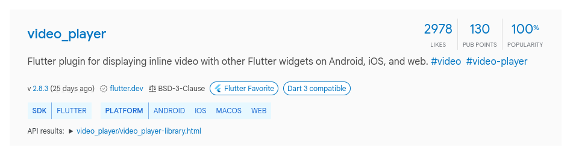
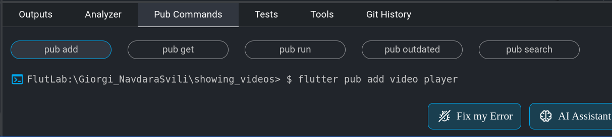
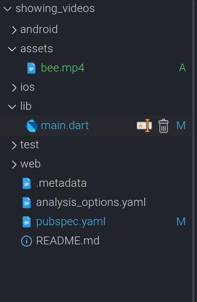

## საწყისი კოდი

```dart
import 'package:flutter/material.dart';

void main() => runApp(MyApp());

class MyApp extends StatelessWidget {
  const MyApp({super.key});

  @override
  Widget build(BuildContext context) {
    return MaterialApp(
      home: MyHomePage(),
    );
  }
}

class MyHomePage extends StatelessWidget {
  
  const MyHomePage({super.key, });  

  @override
  Widget build(BuildContext context) {
    return Scaffold(
      body: Center(
        child: Text(
          'Hello, World!',
        ),
      ),
    );
  }
}

```

## pub.dev
ჩვენს აპლიკაციაში ხშირად შეიძლება გვინდოდეს რაიმე ისეთი კომპონენტის/ფუნქციონალის შექმნა, რომელიც Flutter ფრეიმვორკში არ გვხვდება. ასეთ შემთხვევებში, პირველ რიგში შეგვიძლია შევამოწმოთ [pub.dev](https://pub.dev/) საიტი სადაც გვხვდება უამრავი, ეგრედწოდებული 3-rd party package_ები. 



საძიობო ველში შეგიძლია მოძებნო შენთვის სასურველი ბიბლიოთეკა. ჩვენს შემთხვევაში მოვძებნით video_ს, რის შემდეგაც გამოგვიჩნდება სხვადასხვა ბლიბლიოთეკების ჩამონათვალი. ბიბლიოთეკის სახელებიდან და მოკლე აღწერიდან შეგვიძლია მივხვდეთ, რომელი ბიბლიოთეკა არის ჩვენთვის სწორი. ამ შემთხვევაში video_player ბიბლიოთეკა ავარჩიეთ. (ბიბლიოთეკის სახელი ყოველთვის უნიკალურია).

 

ამ ბიბლიოთეკის ჩვენს აპლიკაციაში შემოტანა უმარტივესი პროცესია: Flutlab_ში ქვედა ფანჯარაში აირჩიე Pub Commands ტაბი



მოცემულ ფანჯარაში შეხვდები წარწერას 'flutter pub add' სადაც შეგვიძლია მივუთითოთ ჩვენთვის სასურველი ბიბლიოთეკის სახელი ჩვენს შემთხვევაში video_player 


დააჭირე კლავიატურაზე 'enter'_ს. ამის შემდეგ გამოვა მესიჯი: 'Package added successfully. Run “pub get” command'. შემდეგ იგივე ფანჯარაში დააჭირე ღილაკს Pub Get.

ამის შემდეგ არჩეული ბიბლიოთეკა დაემატა ჩვენს პროექტში და შეგვიძლია მისი გამოყენება.

## showind videos

პირველ რიგში ჩვენს MyHomePage ვიჯეტს გადავაქცევთ StatefulWidget_ად. 

```dart

class _MyHomePageState extends State<MyHomePage> {
  late VideoPlayerController controller;

  @override
  void initState() {
    super.initState();

    controller = VideoPlayerController.networkUrl(Uri.parse(
        'https://flutter.github.io/assets-for-api-docs/assets/videos/bee.mp4'))
      ..initialize();
    controller.setLooping(true);
    controller.initialize().then((_) => setState(() {}));
    controller.play();
  }

  @override
  Widget build(BuildContext context) {
    return Scaffold(
      body: Center(child: VideoPlayer(controller)),
    );
  }
}


```

მოცემულ კოდში ჩვენთვის ბევრი უცხო სინტაქსია ამიტომ მოდით ვცადოთ მათი მოკლედ ახსნა.

- late ქივორდი საშვალებას გვაძლევს შევქმნათ ცვლადი მნიშვნელობის მინიჭების გარეშე. მაგრამ late ქივორდის გამოყენებით ჩვენ დარტს ვეუბნებით, რომ სანამ ამ ცვლადის გამოყენებას შევეცდები მას აუცილებლად მივანიჭებ მნიშვნელობას. წინააღმდეგ შემთხვევაში ჩვენი პროგრამა დაიქრაშება.
- initState მეთოდი მსგავსად build მეთოდისა აღწერილია State კლასში და Flutter_ი მას გამოიძახებს build მეთოდის გამოძახებამდე. რაც იმას ნიშნავს, რომ სანამ ეკრანზე ჩვენი ვიჯეტი დაიხატება შეგვიძლია საჭირო ცვლადებს მივანიჭოთ მნიშვნელობები.
- VideoPlayerController ტიპის ცვლადის მნიშვნელობას ჩვენ სწორედ initState ფუნქციაში ვანიჭებთ. დამატებით controller ცვლადს რამდენიმე დამატებით პარამეტრს ვანიჭებთ.

1. კონტროლერს ლინკის დახმარებით ვეუნბებით, თუ რომელი ვიდეოს ჩვენება გვინდა.
2. კონტროლერს ვენბებით, რომ ვიდეო ლუპში უნდა გაეშვას.
3. ვაინიციალიზირებთ კონტროლერს.
4. ვიწყებთ ვიდეოს ჩვენებას.


## showing video from assets

პირველ რიგში შექმენი assets ფოლდერი შენს პროექტში და ატვირთე შენი სასურველი ვიდეო:



initState მეთოდში ნაცვლად networkUrl ფუნქციისა ვიყენებთ asset ფუნქციას

```dart
@override
  void initState() {
    super.initState();

    controller = VideoPlayerController.asset('assets/bee.mp4');
    controller.initialize();
    controller.setLooping(true);
    controller.initialize().then((_) => setState(() {}));
    controller.play();

  }

```

შენს პროექტში pubspec.yaml ფაილის ბოლოს დაამატე შემდეგი ინსტრუქცია:

```yaml
flutter:
  uses-material-design: true
  assets:
    - assets/
  
```

სრული ფაილი ასე გამოიყურება:

```yaml
name: showing_videos
description: A new Flutter project.

version: 1.0.0+1

environment:
  sdk: ">=3.0.0 <4.0.0"

dependencies:
  flutter:
    sdk: flutter
  video_player: ^2.5.3

dev_dependencies:
  flutter_test:
    sdk: flutter
  flutter_lints: ^2.0.2

flutter:
  uses-material-design: true
  assets:
    - assets/
  

```

ამის შემდეგ შეგეძლება აპლიკაციასი აჩვენო სასურველი ვიდეო პროექტის ფაილებიდან:
